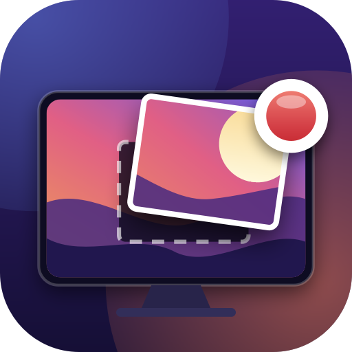

<p align="center">
  
</p>

<h1 align="center">Screensnap</h1>

<p align="center">
  Record a piece of your Mac screen to a <b>GIF</b> or <b>MP4</b>, from the menu bar.<br>
  Native Swift. No accounts, no cloud, no telemetry.
</p>

<p align="center">
  
  
  
  
</p>

<p align="center">
  
</p>

---

## What it does

- **Pick an area, a whole screen, or a window** and record it to a GIF or an H.264 MP4.
- **Stay under a size limit.** Tell it "max 100 MB" (Signal) or "max 8 MB" (Discord) and every recording is shrunk to fit before it is saved.
- **Keep a library.** Every clip lands in one folder, shows up in the app with its size, and can be compressed later to "10 MB" or "720p" — replacing the original or as a sibling file.
- **Talk over it.** MP4 recordings can carry your microphone, with a live level meter so you know it hears you.
- **Show your face.** An optional round facecam bubble, positioned by dragging a live preview.
- **Update itself** from GitHub Releases.

## Install

### Download (recommended)

1. Grab `Screensnap-x.y.z.zip` from the [latest release](https://github.com/note89/screensnap/releases/latest).
2. Unzip it and drag **Screensnap.app** into your **Applications** folder.
3. **Right-click → Open** the first time. (The app is not notarized by Apple, so a plain double-click is refused once.)
4. Start a recording from the menu bar icon. macOS asks for **Screen Recording** permission — grant it, then choose **Relaunch** in the app when it offers.

That is the whole setup. Screensnap has no Dock icon; it lives in the menu bar.

### Build from source

You need the Xcode command-line tools (`xcode-select --install`) and macOS 14 or newer.

```bash
git clone https://github.com/note89/screensnap.git
cd screensnap

./Scripts/setup-signing.sh   # once, optional — keeps permissions across rebuilds (see below)
./Scripts/build-app.sh       # builds ./build/Screensnap.app
open build/Screensnap.app
```

Use `./Scripts/build-app.sh release` for an optimised build. Copy `build/Screensnap.app` to `/Applications` if you want it to stick around.

## Your first recording

<p align="center">
  
</p>

1. Click the **Screensnap icon** in the menu bar and choose **Record area**, **Record full screen**, or **Record window**.
2. For an area, drag a rectangle on any screen. For a window or a screen, pick one from the thumbnails.

   

3. A small **pill** appears at the bottom of the screen showing the timer, the output format, and the frame size. Click **Finish** on it — or press **⌘⇧.** from anywhere.

   

4. The pill shows the **saved file and its size**, and the recording is on your clipboard. Press **⌘V** in Slack, Signal, iMessage, Discord, or a browser to paste it.

   

The **⌘⇧.** hotkey does the obvious thing at every moment: starts a recording in the last used mode, cancels a countdown, or finishes the recording in progress.

## Formats and size limits

Open the app (menu bar → **Open Screensnap…**) and go to **Output**.

<p align="center">
  
</p>

| Format | Audio | Notes |
|---|---|---|
| **GIF** | no | Plays everywhere. Encoded by the built-in ImageIO encoder, ready in about a second. |
| **GIF · best** | no | Same GIF, encoded by [gifski](https://gif.ski) for smoother colour and smaller files. Needs `brew install gifski`; the card says so if it is missing. |
| **MP4** | optional | H.264, roughly a tenth of the size of a GIF. The only format that can carry your voice. |

**Size limit** is where Screensnap earns its keep. Choose a preset — 8 MB (Discord free), 25 MB (Gmail, Slack), 100 MB (Signal) — or type your own. A recording that lands over the limit is shrunk right after encoding (smaller frame first, then fewer frames) until it fits, and the pill reports the final size. If it cannot get under the limit it says so instead of guessing.

## The recordings library

Every clip is saved to one folder — `~/Movies/Screensnap` by default — and the **Recordings** pane is a view of that folder. Change the folder, and the library follows; drop a file into the folder from Finder, and it appears in the list.

<p align="center">
  
</p>

Each row shows a thumbnail, dimensions, duration, size, and date, and has four actions: **Copy** (to the clipboard), **Show** (in Finder), **Compress…**, and **Trash**. Double-click a name to rename it.

**Compress…** opens a small popover: pick a target — a size such as *10 MB* or a resolution such as *720p* — and whether to **keep both** files (the copy is named `original-10MB.mp4`) or **replace the original** (the original goes to the Trash, so it is recoverable).

<p align="center">
  
</p>

## Facecam and voice

- **Facecam** (Facecam pane): turn on the bubble and a live preview appears when recording starts. Drag it anywhere inside the recorded area — the bubble in the file sits exactly where the preview is. If the camera is busy or denied, the recording still happens and the pill tells you why the bubble is missing.
- **Voice** (Output pane, MP4 only): turn on *Record my voice*. The pill shows a level meter while recording. GIFs cannot carry audio, so the option only exists for MP4.

## Permissions

| Permission | Needed for | When asked |
|---|---|---|
| **Screen Recording** | everything | first recording |
| **Camera** | the facecam bubble | first recording with facecam on |
| **Microphone** | voice in MP4 | first MP4 recording with voice on |

The **Capture** pane lists all three with an *Open Settings* button for each. Screen Recording takes effect after a relaunch; the app offers one.

## Keeping permissions across rebuilds (code signing)

macOS ties Screen Recording permission to the app's code-signing identity. An ad-hoc signed build gets a new identity every time, so every rebuild would ask for permission again.

`Scripts/setup-signing.sh` creates a self-signed certificate called **Screensnap Dev** in your login keychain, and `build-app.sh` signs with it automatically from then on. The certificate never leaves your machine and is not committed.

```bash
./Scripts/setup-signing.sh                         # once
security find-identity -v -p codesigning           # should list "Screensnap Dev"
security delete-certificate -c "Screensnap Dev"    # to remove it later
```

Builds signed before the rename with the older `GifRecorder Dev` certificate keep working; the build script honours both.

## Updates

Screensnap checks GitHub Releases once a day. When a newer version exists the menu shows **Update to x.y.z…**, and the **About** pane has an **Update and relaunch** button that downloads the zip, swaps the app bundle in place, re-signs it with your local certificate (so permissions survive), and relaunches.

If the app sits in a folder you cannot write to, the new build is placed in your Downloads folder instead and the About pane tells you.

## Optional: gifski

[gifski](https://gif.ski) produces noticeably better GIFs than the built-in encoder. Install it and choose **GIF · best**:

```bash
brew install gifski
```

Screensnap finds it in the usual Homebrew locations. To ship it inside the app instead, drop a `gifski` binary into `Resources/` before building. If gifski is missing at recording time the app records with the built-in encoder and says so, rather than failing.

## Project layout

```
Sources/Screensnap/
  ScreensnapApp.swift        @main: MenuBarExtra, settings Window, app delegate
  Coordinator.swift          Single owner of app state: phase, session, delivery
  Phase.swift                The recording state machine as an enum
  Output.swift               Output (GIF / GIF·best / MP4·voice), SizeLimit, ByteCount, Dimensions
  Settings.swift             UserDefaults-backed preferences (@Observable)
  MenuView.swift             The menu bar menu
  SettingsWindow.swift       Capture / Output / Facecam / Recordings / About panes
  HUD/HUDPanel.swift         Non-activating floating pill (NSPanel)
  HUD/HUDView.swift          Pill contents per phase
  SourcePicker.swift         Display / window picker with live thumbnails
  RegionSelector.swift       Drag-to-select overlay across all displays
  ScreenRecorder.swift       ScreenCaptureKit stream → frame sink
  Encoders.swift             GIF (ImageIO, gifski) and MP4 (AVAssetWriter) encoders
  Facecam.swift              Camera capture, bubble compositing, draggable preview
  Microphone.swift           Microphone capture with level metering
  Recordings/Recording.swift Recording, MediaInfo, Thumbnail, Clipboard
  Recordings/RecordingsStore.swift  The library: folder scan + file watcher
  Recordings/Compressor.swift       Compress to a size or a resolution
  Updater.swift              GitHub Releases check, download, swap, relaunch
  Permissions.swift          TCC checks, System Settings deep links, Relaunch
  GlobalHotkey.swift         Carbon RegisterEventHotKey wrapper

Resources/      Info.plist, AppIcon.icns (generated by Scripts/make-icon.swift)
Scripts/        build-app.sh, setup-signing.sh, make-icon.swift
.github/        release.yml — builds and publishes a zip on every v* tag
docs/           Screenshots used in this README
```

## Releasing (maintainers)

```bash
git tag v0.3.0
git push origin v0.3.0
```

The **Release** workflow stamps the version into `Info.plist`, builds `Screensnap.app`, zips it as `Screensnap-0.3.0.zip`, and publishes a GitHub Release with generated notes. Running apps pick it up on their next daily check.

## License

MIT
